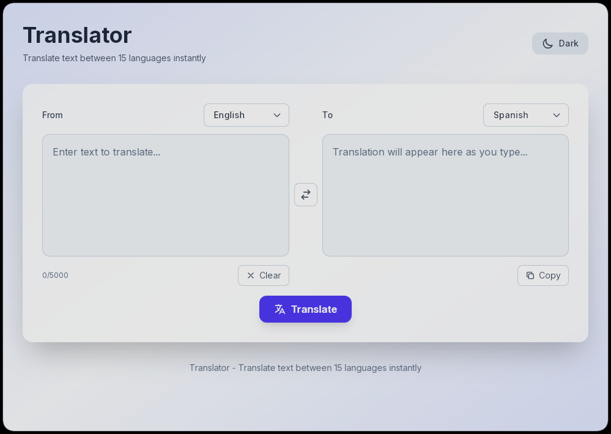

# Translator

A modern cross-platform desktop translation application built with **Tauri** and **Angular**. Translate text between 15 languages instantly with a clean, responsive interface powered by `translate-shell`.

## Screenshots

<details>
  <summary>Spoiler</summary>
  <h3>Main page</h3>
  
</details>

## Features

- **🚀 Real-time Translation**: Instant translation as you type with a built-in 500ms debounce to optimize performance.
- **🌍 15 Languages Supported**: English, Spanish, French, German, Italian, Portuguese, Russian, Japanese, Korean, Chinese, Arabic, Hindi, Dutch, Polish, and Turkish.
- **🌓 Dark/Light Mode**: Automatic and manual toggle between dark and light themes for a comfortable viewing experience.
- **🔄 Language Swap**: One-click button to quickly swap between source and target languages.
- **📋 Clipboard Integration**: Copy your translations to the clipboard instantly with dedicated UI feedback.
- **⌨️ Keyboard Shortcuts**: Support for `Ctrl+Enter` (or `Cmd+Enter`) to force a translation immediately.
- **📱 Cross-Platform**: Native support for Linux, macOS, Windows, and experimental support for Android.

## Tech Stack

- **Frontend**: [Angular v21](https://angular.io/) (Standalone Components, Signals)
- **Backend**: [Tauri v2](https://tauri.app/) (Rust)
- **Engine**: [translate-shell](https://github.com/soimort/translate-shell) (`trans` CLI)
- **Styling**: TailwindCSS v4
- **Package Manager**: [Bun](https://bun.sh/)

## Installation

#### Checking the installed tools to launch the project

First make sure you have Node.js installed.
To do this, open a command prompt or terminal and type the following commands:

```bash
node -v
```

```bash
npm -v
```

If you are using the bun package manager, then run this command:

```bash
bun -v
```

#### Installation dependencies

After that, go to the folder with this project and run the following command:

```bash
npm install
```

If you are using the bun package manager, then run this command:

```bash
bun install
```

#### Checking the Rust compiler

In order to run a Rust application, you need to make sure that you have a compiler for Rust.
To find out if you have one, enter the following command:

```bash
rustc --version
```

If you get an error instead of a version, it means that you don't have a Rust compiler. In order to set it up, go to the [official website](https://www.rust-lang.org/tools/install) and follow the instructions on the website.

#### Installing translate-shell

- **Ubuntu/Debian**: `sudo apt-get install translate-shell`
- **macOS**: `brew install translate-shell`
- **Arch Linux**: `sudo pacman -S translate-shell`

## Usage

After installing the dependencies, use the following command to run, depending on the package manager you are using:

```bash
npm run tauri dev
```

Or

```bash
bun run tauri dev
```

## Build Optimization

This project includes optimizations to reduce build times and ensure high performance:

### Build Scripts

Use the optimized build scripts that only rebuild components when source files have changed:

```bash
# Build desktop application (only rebuilds if files changed)
bun run build:smart

# Build for Android
bun run build:smart:android

# Clean build artifacts
bun run build:clean
```

### Key Optimizations

1. **Incremental Compilation**: Rust code uses incremental compilation to avoid recompiling unchanged code.
2. **Smart Frontend Building**: Frontend is only rebuilt when source files change.
3. **Modern Frontend Features**: Utilizes Angular v21 Signals and Control Flow for optimized change detection and performance.
4. **Rust Backend Performance**: Spawns asynchronous tasks to execute the `trans` command, ensuring the UI remains responsive during translations.

## Authors

- [Dmitriy303](https://github.com/rusnakdima)

## License

This project is licensed under the [MIT License](LICENSE.MD).

## Contact

If you have any questions or comments about this project, please feel free to contact us at [rusnakdima03@gmail.com](mailto:rusnakdima03@gmail.com).
